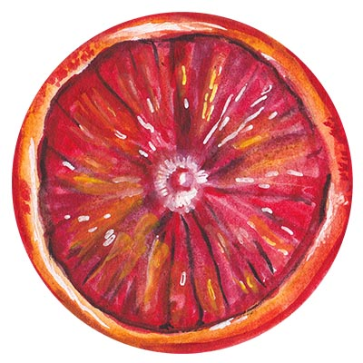

# juice
Generate random combinations from pre-defined character sets




# Install
`npm install qantra-juice`

# Usage

juice constructor takes two arguments

@param { Object } containing the character sets that you will reference in the second argument to create combinations
@param { Object } containing the combinations with array referencing what should be used in the combination


```
//defining the sets

const sets = {
  lowercase: 'abcdefghijklmnopqrstuvwxyz',
  uppercase: 'ABCDEFGHIJKLMNOPQRSTUVWXYZ',
  numbers: '1234567890',
  special: '@%+!#$?:~'
}

// defining the combinations and referencing each combination with the used sets

const combos = {
  'lowercase': ['lowercase'],
  'uppercase': ['uppercase'],
  'numbers': ['numbers'],
  'alpha-numeric': ['lowercase','uppercase','numbers'],
  'complex': ['lowercase','uppercase','numbers','special'],
  'lowercase-alpha-numeric': ['lowercase', 'numbers'],
  'uppercase-alpha-numeric': ['uppercase', 'numbers']
}


let juice = new Juice( sets, combos );


juice.generate('uppercase-alpha-numeric', 20) //39ISJ0830004090S3T03   - using sets ['uppercase', 'numbers']

juice.generate('complex', 20) //4q15@5i54HDqH$d@54K@ - using sets ['lowercase','uppercase','numbers','special']

juice.generate('alpha-numeric', 70) //o1jWa4xV143vDSAKatR91f50I4I61aLV486kD5TALewKV0lfK01S1KkSDKn1lAR11Ya30k - using sets ['lowercase','uppercase','numbers']

juice.generate('lowercase', 10) //gbsimffbiy - using sets ['lowercase']

```
